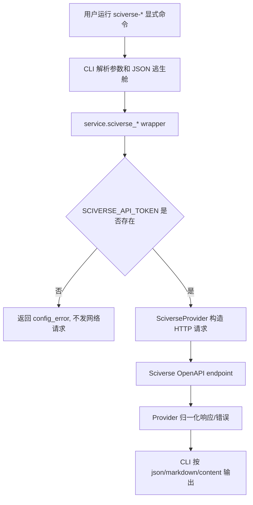

# Sciverse 学术检索 Provider Design

## 0. 术语约定

| 术语 | 定义 | 防冲突结论 |
|---|---|---|
| Sciverse | OpenDataLab 的学术文献检索平台，当前 OpenAPI version 为 `0.9.0` | 仓库内当前无 `sciverse` 代码命名，可新增 provider id `sciverse` |
| `vertical_search` | Smart Search 的实验性垂直检索能力 | 现有 provider 是 AnySearch；Sciverse 也归属该能力，但第一版不进入默认路由 |
| 显式命令 | 用户直接运行 `sciverse-*` 命令，命令只调用 Sciverse | 区分于 `smart-search search` / `research` 的自动 provider fallback |
| `unique_id` | Sciverse 元数据记录的稳定论文标识，可用于引用关系 | 不等同于 `doc_id` |
| `doc_id` | Sciverse 全文 artifact 标识，用于 `read_content` | 只有存在全文且授权可读时才有 |
| 引用关系 | `CITATIONS` 表示谁引用了目标论文，`REFERENCES` 表示目标论文引用了谁，`RELATED_WORKS` 表示相关工作 | design 和 CLI help 必须写清方向，避免用户反着用 |
| native HTTP adapter | Smart Search 直接调用 Sciverse OpenAPI endpoint | 区分于在 Smart Search 内启动 `sciverse-mcp-server` |

## 1. 决策与约束

### 需求摘要

本 feature 为需要学术文献证据的用户新增 Sciverse provider。成功标准是：配置 `SCIVERSE_API_TOKEN` 后，用户可以通过显式 CLI 命令完成字段 catalog、结构化论文搜索、语义搜索、正文片段读取和论文关系查询；没有 token 时返回清楚的配置错误；无论是否配置 Sciverse，都不改变 `SMART_SEARCH_MINIMUM_PROFILE=standard` 和默认 `search` / `research` 路径。

明确不做：

- 不把 Sciverse 放进 `docs_search`。
- 不把 Sciverse 加入默认 `smart-search search` 或 `smart-search research` fallback。
- 不让 Smart Search 第一版启动或托管 `sciverse-mcp-server` / `npx` 子进程。
- 不实现 `get_resource` 图片/表格资源命令。
- 不新建通用 MCP schema discovery 抽象。
- 不在输出、日志、doctor 或测试快照中泄露 `SCIVERSE_API_TOKEN`。

### 复杂度档位

- `dependency category = true external`：Sciverse 是第三方远程服务，必须通过 provider adapter 隔离 HTTP、auth、timeout 和错误归一化。
- `surface = CLI + service + provider + docs + tests`：它不是纯 provider 文件新增，还要接入配置、命令、诊断、文档和 skill 资产。
- `routing = explicit-only`：第一版有 capability 身份和诊断状态，但不加入默认 fallback order。
- `frontend = not applicable`：本 feature 没有前端 UI。

### 关键决策

1. 选用 native HTTP/OpenAPI adapter，而不是 MCP server 宿主。
   原因：Sciverse 已有 `openapi.yaml`，当前 Smart Search provider 也是 Python HTTP adapter 风格；直接 HTTP 调用更容易复用现有 config、timeout、测试和错误语义。MCP server 方式会引入 Node 版本、进程生命周期和 stdio/HTTP transport 额外风险。

2. 第一版保留显式命令，不自动参与 `search` / `research`。
   原因：学术检索的 token、配额、字段和正文授权都更重。默认路由一旦混入，会让普通查询意外消耗学术 provider，也会把 schema 错误带进主搜索体验。

3. 第一版包含 `sciverse-relations`。
   原因：引用/被引/相关工作关系是 Sciverse 区别 Exa 和 AnySearch 的核心价值。没有 relations，第一版会退化成普通论文搜索。

4. 第一版不做 `get_resource`。
   原因：图片/表格资源是二进制或 base64 输出，牵涉文件输出、多模态消费和 Markdown 图片引用安全边界，应独立设计。

5. 高级学术字段走 JSON 逃生舱。
   原因：Sciverse 字段 catalog 会演进，第一版只把高频字段做一等 CLI 参数，其余走 `--filters-advanced` / `--sort-advanced` JSON，避免追满字段导致频繁漂移。

### Top 3 风险与缓解

| 风险 | 为什么危险 | 缓解 |
|---|---|---|
| 参数 schema 漂移 | 学术字段和枚举值变化会让 hardcode CLI 变脆 | `sciverse-catalog` 是第一等命令，search 保留 JSON 逃生舱，文档要求先查 catalog |
| 误入默认路由 | 会改变现有 `search` / `research` 行为和 token 消耗 | checklist 和验收必须反向验证默认路由不调用 Sciverse |
| 无真实 token 难以 live 证明 | mock 只能证明本地契约，不能证明远端授权和字段可用 | 没 token 时以 mock + schema 测试为 blocking，live smoke 作为有 token 时的 supporting gate |

### 非显然依赖与假设

- 依赖 Sciverse OpenAPI `0.9.0` 的 endpoint shape：`/meta-catalog`、`/meta-search`、`/agentic-search`、`/content`、`/meta-paper-relations`。
- 假设 Sciverse API base URL 默认可设为 `https://api.sciverse.space`，并允许通过 `SCIVERSE_API_URL` 覆盖。
- 假设 license 可按仓库 `LICENSE` 和 npm package 的 `Apache-2.0` 处理；GitHub API `licenseInfo` 当前返回 `Other`，不能在文档里写成“GitHub license API 已确认 Apache-2.0”。
- 假设没有 `SCIVERSE_API_TOKEN` 时仍应保持 standard minimum profile 通过，只要 `main_search`、`docs_search`、`web_fetch` 已满足。

### 证据计划

- 单元测试证明 provider payload、headers、错误映射和输出归一化。
- service 测试证明 config、capability status、minimum profile 和默认路由不变。
- CLI 测试证明五个显式命令、JSON 参数校验、exit code 和渲染。
- regression / smoke 证明 provider 架构没破坏现有 fallback。
- 文档/skill 同步测试证明 README.md、README.zh-CN.md、provider contract、public skill 和 packaged skill 同步。
- 如果使用真实 token 做 live smoke，提交前必须针对 token 子串做 secret scan。

### 基线风险

当前分支已有本 feature 的 untracked brainstorm / requirement / design 产物，代码尚未改动。实现开始前先跑轻量 focused tests 或至少 `git status --short` 确认只包含本 feature 相关文件，避免把 #17/#19 之后的旧状态混进 #18。

## 2. 名词与编排

### 2.1 名词层

#### 现状

- `src/smart_search/providers/anysearch.py`：`AnySearchProvider` 是当前唯一 `vertical_search` provider，实现 JSON-RPC MCP 调用、结果归一化和错误映射。
- `src/smart_search/config.py`：`SmartSearchConfig` 已维护 `ANYSEARCH_API_URL`、`ANYSEARCH_API_KEY`、`ANYSEARCH_TIMEOUT_SECONDS`，并在 `get_config_info()` 中做密钥掩码。
- `src/smart_search/service.py`：`PROVIDER_PROFILES`、`get_capability_status()`、`validate_minimum_profile()` 和 `anysearch_*` service wrapper 共同定义 capability、诊断和显式 provider 命令。
- `src/smart_search/cli.py`：`COMMAND_ALIASES`、parser、dispatch、setup flags 和输出渲染共同暴露 `anysearch-*` 命令。
- `.trellis/spec/backend/provider-capability-contract.md`、README 和 `skills/smart-search-cli/**` / packaged skill 资产记录 provider 契约。
- 当前没有 Sciverse provider、Sciverse config key 或 `sciverse-*` CLI 命令。

#### 变化

新增 `SciverseProvider`，作为 true external HTTP adapter，统一隐藏 Sciverse endpoint、Bearer token、timeout、HTTP error 和输出归一化。provider 对外提供五个能力：

- `list_catalog(collection, include_sample_values, include_field_stats)`
- `search_papers(...)`
- `semantic_search(query, top_k, mode, source_types)`
- `read_content(doc_id, offset, limit)`
- `list_paper_relations(unique_id, relation, page, page_size)`

新增配置：

- `SCIVERSE_API_TOKEN`：必需 secret；缺失时显式命令返回 `config_error`，不发网络请求。
- `SCIVERSE_API_URL`：默认 `https://api.sciverse.space`。
- `SCIVERSE_TIMEOUT_SECONDS`：默认 `30`。

新增显式 CLI 命令：

```text
smart-search sciverse-catalog
  [--collection papers|authors|sources]
  [--include-sample-values]
  [--include-field-stats]
  [--format json|markdown|content]

smart-search sciverse-search [QUERY]
  [--collection papers|authors|sources]
  [--title-contains TEXT]
  [--abstract-contains TEXT]
  [--authors CSV]
  [--journals CSV]
  [--subjects CSV]
  [--year-from YEAR]
  [--year-to YEAR]
  [--filters-advanced JSON_ARRAY]
  [--sort-advanced JSON_ARRAY]
  [--sort-by-year desc|asc|none]
  [--freshness-boost NONE|MILD|STRONG]
  [--page N]
  [--page-size N]
  [--format json|markdown|content]

smart-search sciverse-semantic QUERY
  [--top-k N]
  [--mode fast|balanced|quality]
  [--source-types CSV]
  [--format json|markdown|content]

smart-search sciverse-read DOC_ID
  [--offset N]
  [--limit N]
  [--format json|markdown|content]

smart-search sciverse-relations UNIQUE_ID
  [--relation CITATIONS|REFERENCES|RELATED_WORKS]
  [--page N]
  [--page-size N]
  [--format json|markdown|content]
```

输出沿用 provider-specific command 风格，不把显式命令伪装成 fallback attempt。每个结果至少包含：

```json
{
  "ok": true,
  "provider": "sciverse",
  "tool": "search_papers",
  "elapsed_ms": 123.4,
  "results": [],
  "raw": {}
}
```

错误映射：

- token 缺失：`config_error`，不发网络请求。
- HTTP 401/403：`auth_error`，message 不含 token。
- HTTP 400：`parameter_error`，用于字段、枚举、JSON 参数错误。
- HTTP 404：`provider_error`，用于关系查询中 `unique_id` 不存在等远端业务错误。
- HTTP 429：`rate_limited`。
- HTTP 502/503 和 network error：`network_error`。
- timeout：`timeout`。
- 非 JSON / schema 不符合预期：`provider_error` 或 `parse_error`，按现有 provider 约定归一化。

##### Interface 设计检查

- Module：`SciverseProvider`，新增 provider module。
- Interface：caller 只知道五个方法、配置项、错误类型和归一化输出；caller 不需要知道 endpoint path、Authorization header 或 Sciverse 原始 response shape。
- Seam：seam 放在 service wrapper 调 provider 的位置；CLI 和测试都穿过 service wrapper 或 provider public method 观察行为。
- Depth / locality：复杂度集中在 provider 内。删除 provider 后，HTTP path、auth、error mapping 和 response normalization 不会散到 CLI/service。
- Dependency strategy：true external。测试使用 monkeypatch 的 `httpx.AsyncClient` fake，不依赖真实 Sciverse token。
- Adapter：production HTTP adapter + test fake client。不是为了抽象而抽象，因为 Sciverse 是远程第三方服务且需要无 token mock。
- Test surface：catalog/search/semantic/read/relations 的 payload、headers、错误映射和 normalized output 都可通过 public methods 观察。

### 2.2 编排层



#### 现状

现有 provider 编排是 CLI parser -> service wrapper -> provider adapter -> normalized dict -> CLI render。AnySearch 的显式命令已经提供可复用形状：provider-specific command 不参与 minimum profile，也不自动进入 web/docs/fetch fallback。`search` 和 `research` 的默认路径由 capability routing 和 provider order 控制。

#### 变化

新增 Sciverse 的编排支线，但只挂在显式命令、配置、诊断和文档上。第一版不修改 `IntentRouter` 对学术意图的能力选择，不把 Sciverse 加进 `_run_vertical_search_fallback()` 或 `RESEARCH_PROFILE_ORDER["vertical_search"]` 的自动执行链。若需要在未来让 `research` 使用 Sciverse，必须另起 routing acceptance task。

#### 流程级约束

- 顺序：`sciverse-read` 需要用户先从 `sciverse-search` 或 `sciverse-semantic` 得到 `doc_id`；`sciverse-relations` 需要 `unique_id`。
- 幂等性：五个命令均为只读；重复调用不改变本地配置或远端数据。
- 输入校验：JSON 逃生舱必须在 CLI 层先验证为 array/object，不合法时不发网络请求。
- 上下限：`page` 从 1 开始；`sciverse-search --page-size` 最大 50；`sciverse-semantic --top-k` 最大 30；`sciverse-read --limit` 最大 16384；`sciverse-relations --page-size` 最大 200。超出时本地优先返回 `parameter_error`，不要等远端报错。
- 观察点：输出包含 `provider`、`tool`、`elapsed_ms`；`doctor` / capability status 可看到是否配置，但不测试真实 token 时不宣称 live 可用。
- 安全：所有 config/info/doctor/错误输出只显示 masked token 或“未配置”，不打印 `Authorization` header。

### 2.3 挂载点清单

- 配置 key：`src/smart_search/config.py` 的允许配置、默认值、mask 显示和 setup 保存路径新增 `SCIVERSE_*`。
- Provider capability 诊断：`src/smart_search/service.py` 的 provider profile / capability status 新增 Sciverse 的实验性 vertical provider 状态，但不接入默认 fallback order。
- CLI 命令入口：`src/smart_search/cli.py` 新增 `sciverse-*` aliases、parser、dispatch、setup flags 和 human-readable rendering。
- 契约文档入口：README.md、README.zh-CN.md、`.trellis/spec/backend/provider-capability-contract.md`、public skill 与 packaged skill provider routing 文档新增 Sciverse 边界。

### 2.4 推进策略

1. 配置与 provider 骨架：新增 Sciverse config 和 HTTP adapter，先让 mock catalog/search/read/relations 路径返回 normalized dict。
   退出信号：focused provider/config tests 证明 token 缺失不发网络请求，token 存在时发送 Bearer header。

2. 五个 provider 计算节点：补齐 catalog/search/semantic/read/relations payload、response normalization、错误映射和边界值。
   退出信号：provider tests 覆盖 200、400、401、429、timeout、非 JSON、relations enum，以及 search page_size 最大 50、semantic top_k 最大 30、read limit 最大 16384、relations page_size 最大 200 的本地 `parameter_error`。

3. Service 与 capability 诊断：新增 `sciverse_*` wrapper、provider profile、capability status，同时证明 standard minimum profile 和默认 routing 不变。
   退出信号：service tests 证明 `SCIVERSE_API_TOKEN` 配置只影响 Sciverse 显式状态，不让 standard 多一项要求，也不让 `search` / `research` 自动调用 Sciverse。

4. CLI 命令面：新增五个 `sciverse-*` 命令、aliases、JSON 参数校验、setup/config flags 和 markdown/content 渲染。
   退出信号：CLI tests 证明 parser/dispatch/exit code 正确，非法 JSON 在 service call 前失败。

5. 文档与 skill 同步：更新 README.md、README.zh-CN.md、provider contract、public skill、packaged skill，明确 Sciverse 是显式实验 provider。
   退出信号：skill 同步 regression 通过，README.md、README.zh-CN.md 和 skill 文档中没有把 Sciverse 写入 default search/research fallback。

6. 回归与可选 live smoke：跑 source checkout provider regression、mock smoke 和 diff check；若用户提供 token，再跑一次 live catalog/search/semantic/read/relations 最小链路。
   退出信号：blocking commands 全绿；有 token 时 live smoke 记录响应摘要且 secret scan 无命中。

### 2.5 结构健康度与微重构

##### 评估

- compound convention：`.codestable/compound/` 当前只有 `.gitkeep`，没有目录组织 / 文件归属 / 命名约定沉淀可复用。
- 文件级 - `src/smart_search/service.py`：约 4116 行，已经承担 provider registry、routing、research、doctor、smoke 和 provider wrappers；本 feature 会新增 registry/status/wrapper，但不应继续把 HTTP 计算逻辑放进去。
- 文件级 - `src/smart_search/cli.py`：约 3148 行，集中处理 parser、dispatch、setup 和 rendering；本 feature 需要在既有入口登记命令，但不应在 CLI 内实现 provider 逻辑。
- 文件级 - `src/smart_search/config.py`：约 804 行，已有 provider config 属性和 masking；新增 3 个 key 是现有职责延伸。
- 目录级 - `src/smart_search/providers/`：现有 10 个 provider 文件，本次预计新增 1 个 `sciverse.py`；目录已有同类 provider 模式，新增一项不需要重组。
- 目录级 - `tests/`：现有 provider 测试按 provider family 平铺，本次预计新增 1 个 `test_sciverse_provider.py` 并扩展 service/cli/smoke 测试；暂不触发目录重组。

##### 结论：不做微重构

本 feature 不做“只搬不改行为”的微重构。原因：真正需要隔离的新复杂度可以落进新文件 `src/smart_search/providers/sciverse.py`；service/cli/config 的改动属于既有挂载点登记，虽然文件偏胖，但把它们拆开会超出本 feature 的行为边界。

##### 超出范围的观察

- `src/smart_search/service.py` 和 `src/smart_search/cli.py` 已经明显偏胖，后续若继续增加 provider，建议另起 `cs-refactor` 做 provider registry / CLI provider command registration 的受控拆分。本 feature 只避免继续把 HTTP 计算逻辑塞进胖文件。

## 3. 验收契约

### 关键场景清单

1. 配置缺失：未配置 `SCIVERSE_API_TOKEN` 时运行任意 `sciverse-*` 命令，返回 `ok=false`、`error_type=config_error`，且 provider mock 证明未发网络请求。
2. Catalog：配置 token 后运行 `sciverse-catalog --collection papers --format json`，请求带 Bearer header，输出包含 `provider=sciverse`、`tool=list_catalog`、`fields` / `default_fields` / `filter_operators`。
3. 结构化搜索：运行 `sciverse-search "transformer retrieval" --year-from 2020 --page-size 5 --format json`，payload 映射到 `search_papers`，输出保留论文 `unique_id`、可选 `doc_id`、title、metadata 和 pagination。
4. JSON 逃生舱：`--filters-advanced` 或 `--sort-advanced` 非 JSON array 时，CLI 返回 `parameter_error` 且不调用 service。
5. 语义搜索：运行 `sciverse-semantic "attention mechanism" --top-k 3 --mode balanced --format json`，payload 映射到 `semantic_search`，输出保留 `hits`、`doc_id`、`offset` 和 score。
6. 正文读取：运行 `sciverse-read DOC_ID --offset 0 --limit 4096 --format json`，payload 映射到 `read_content`，输出包含 `text`、`bytes_returned`、`next_offset`、`more`。
7. 引用关系：运行 `sciverse-relations UNIQUE_ID --relation CITATIONS --page-size 25 --format json`，payload 映射到 `list_paper_relations`，输出包含 `items`、`total_count`、`page`、`total_pages`，并保持 `CITATIONS` / `REFERENCES` 方向说明。
8. 参数上限：`sciverse-search --page-size 51`、`sciverse-semantic --top-k 31`、`sciverse-read --limit 16385`、`sciverse-relations --page-size 201` 均在本地返回 `parameter_error`，且不调用 provider。
9. 错误映射：Sciverse HTTP 401/403、400、429、timeout、502/503 分别归一化为 `auth_error`、`parameter_error`、`rate_limited`、`timeout`、`network_error`，错误文本不含 token。
10. standard profile 不变：配置或不配置 Sciverse，都不改变 `validate_minimum_profile().required == ["main_search", "docs_search", "web_fetch"]`。
11. 默认路由不变：配置 Sciverse token 后，普通 `search` / `research` 的 provider attempts 不出现 `sciverse`，除非未来另起 routing task。
12. 文档同步：README.md、README.zh-CN.md、public skill、packaged skill 和 provider contract 都说明 Sciverse 是显式实验学术 provider，不是 docs_search，不是 standard minimum profile。

### 明确不做的反向核对项

- 代码中不应出现 Smart Search 启动 `sciverse-mcp-server`、`npx sciverse-mcp-server` 或托管 Sciverse MCP 子进程的逻辑。
- `RESEARCH_PROFILE_ORDER["vertical_search"]` 和 `_run_vertical_search_fallback()` 不应让 Sciverse 参与默认 route/fallback。
- README / skill 不应写“Sciverse satisfies standard profile”或“Sciverse is docs_search”。
- 第一版不应出现 `sciverse-resource` / `get_resource` 用户命令。
- 测试快照和错误输出不应包含真实 `SCIVERSE_API_TOKEN` 子串。

### Acceptance Coverage Matrix

| Scenario | Covered By Step | Evidence Type | Command / Action | Core? |
|---|---|---|---|---|
| 配置缺失不发网络请求 | S1, S2 | test | `pytest tests/test_sciverse_provider.py -q` | yes |
| Catalog/search/semantic/read/relations happy path | S2, S4 | test | `pytest tests/test_sciverse_provider.py tests/test_cli.py -q` | yes |
| CLI JSON 逃生舱校验 | S4 | test | `pytest tests/test_cli.py -q` | yes |
| 参数上限本地校验 | S2, S4 | test | `pytest tests/test_sciverse_provider.py tests/test_cli.py -q` | yes |
| 错误映射和 secret masking | S2, S4 | test / diff review | provider tests + targeted secret scan when live token used | yes |
| standard minimum profile 不变 | S3 | test | `pytest tests/test_service.py -q` | yes |
| 默认 search/research 不调用 Sciverse | S3, S6 | test / smoke | `pytest tests/test_service.py tests/test_smoke.py -q` | yes |
| README.md / README.zh-CN.md / skill / provider contract 同步 | S5 | test / diff review | `smart-search regression` / skill contract tests | yes |
| 可选 live smoke | S6 | API response | `.\.venv\Scripts\python.exe -m smart_search.cli sciverse-catalog --format json` plus one search/read/relations chain when token exists | no |

### DoD Contract

| ID | 要求 | 证据 | 阻塞级别 |
|---|---|---|---|
| DOD-DESIGN-001 | design 与 checklist 通过 design review，无 blocking finding | design-review report | blocking |
| DOD-IMPL-001 | checklist steps 全部完成，Sciverse 代码/文档/测试均落盘 | checklist / diff summary | blocking |
| DOD-REVIEW-001 | code review passed 且无 unresolved blocking | review report | blocking |
| DOD-QA-001 | blocking validation commands 全绿 | QA report / command output | blocking |
| DOD-ACCEPT-001 | acceptance 反查挂载点、范围守护和文档同步 | acceptance report | blocking |

Validation Commands:

| ID | 命令 | 目的 | 核心性 | 失败处理 |
|---|---|---|---|---|
| CMD-001 | `.\.venv\Scripts\python.exe -m compileall -q src tests` | Python 语法和 import 基线 | core | fix-or-block |
| CMD-002 | `.\.venv\Scripts\python.exe -m pytest tests\test_sciverse_provider.py tests\test_service.py tests\test_cli.py tests\test_smoke.py -q` | focused provider/service/CLI/smoke 回归 | core | fix-or-block |
| CMD-003 | `.\.venv\Scripts\python.exe -m smart_search.cli regression` | source checkout regression | core | fix-or-block |
| CMD-004 | `.\.venv\Scripts\python.exe -m smart_search.cli smoke --mock --format json` | mock provider routing smoke | core | fix-or-block |
| CMD-005 | `git diff --check` | 空白和 diff hygiene | core | fix-or-block |
| CMD-006 | `.\.venv\Scripts\python.exe -m smart_search.cli sciverse-catalog --format json` | 真实 token 可用时的 source checkout live catalog smoke | supporting | document-baseline |

Required Artifacts: design review、implementation evidence、code review、QA report、acceptance report；若执行 live smoke，还要记录脱敏响应摘要和 secret scan 结果。

清洁度规则：不允许提交临时 debug print、注释掉的实验代码、未使用 import、临时 TODO/FIXME、真实 token 或完整 Authorization header。文档示例只能使用占位 token。

### 自我批判结论

- 可证伪性：关键场景均改写为输入/触发和可观察输出，没有使用“稳定、好用”这类弱标准。
- 步骤原子性：provider、service、CLI、docs、regression 分开，任何一步失败都能定位层级。
- 最弱依赖：真实 token 不作为 blocking gate；mock 契约先保障本地实现，live smoke 作为可选增强。
- 接口深度：新增 `SciverseProvider` 有真实 external seam，不是 pass-through；CLI/service 不承担 HTTP 细节。
- 清洁度：secret masking 和 no default routing 都有反向核对项。

## 4. 与项目级架构文档的关系

- `.trellis/spec/backend/provider-capability-contract.md` 需要新增 Sciverse 的配置、显式命令、错误映射、minimum profile 边界和默认路由反向约束。
- README.md、README.zh-CN.md、public skill 与 packaged skill 需要同步说明 `sciverse-*` 命令和实验边界。
- `requirements/sciverse-academic-search.md` 当前是 draft；feature acceptance 通过后应由 `cs-req update` 升级为 current，并按实际实现刷新边界。
- “Sciverse 作为显式 experimental vertical provider、不进入默认 route”属于结构性决策。若用户希望长期沉淀该 provider 分类规则，design 通过后建议走 `cs-domain` 追加 ADR；本 design 不直接写 ADR。
