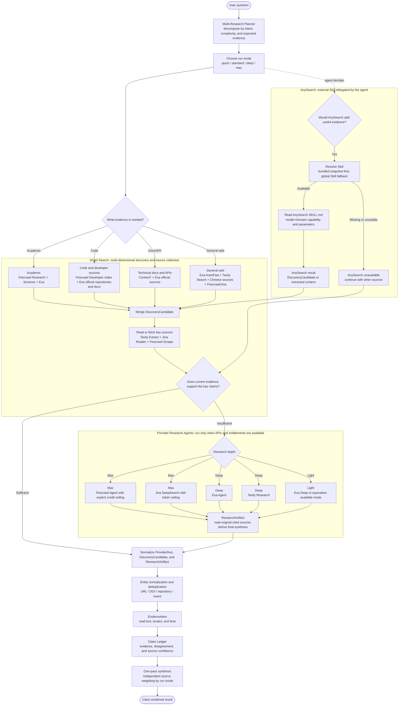

# Smart Search CLI

Use the local `smart-search` command as the default execution layer for web research. This entrypoint keeps only routing, boundaries, and reference selection; load the focused reference file when command details or provider contracts matter.

## What This Skill Is

`smart-search-cli` is an instruction bundle for an AI tool. It explains when to call the local `smart-search` executable, which command fits the user's intent, how to preserve source evidence, and how to interpret provider status and fallback fields.

- The Skill delegates ordinary search and research commands to the configured `smart-search` CLI. It also carries an unchanged AnySearch Skill snapshot for agent-level supplemental retrieval; AnySearch is not a Smart Search provider.
- The Skill is not an MCP server, does not store provider API keys, and does not create Trellis, hooks, agents, or commands.
- `smart-search setup --install-skills ...` is the first-install path. After a CLI upgrade, use `skills status` for a read-only check and `skills update` to refresh only the managed Skill files.
- Skill updates do not change provider configuration or API keys. Missing optional keys remain skipped rather than being treated as successful live checks.

## Default Workflow

1. Run `smart-search doctor --format json` when configuration or availability is uncertain.
2. If `doctor` reports missing configuration, use `smart-search setup` or `smart-search config set KEY VALUE` when the user provides keys. Do not ask users to edit global environment variables by default.
3. If OpenAI-compatible `search` hangs or times out after `doctor` succeeds, run `smart-search diagnose openai-compatible --format markdown` and use its summary.
4. For resilient xAI search, run `smart-search search "QUERY" --timeout 120 --max-try 5 --format json` and wait for the CLI to finish; do not implement another retry loop in the agent.
5. If `doctor` returns `ok: true`, use only `smart-search` CLI subcommands for web research. Do not call Codex native web search in the same task.
6. Use `smart-search skills status --targets codex --format json` when the installed global skill may be stale; use `smart-search skills update --targets codex --format json` to refresh it without rerunning setup.
7. Use `smart-search smoke --mock --format json` after CLI/provider architecture changes. Use `--live` only when real keys are available and the user expects live checks.
8. Treat `TAVILY_ENABLED=false` as an intentional no-network boundary: do not work around it with direct Tavily or `map` calls. Check `doctor` and live smoke for disabled/skipped Tavily state; Firecrawl remains independently configured.
9. Preserve command lines and source URLs in your answer. Prefer citing fetched pages or `primary_sources`; treat `extra_sources` as follow-up candidates until fetched.
10. When AnySearch can materially improve vertical, batch, or URL evidence, resolve it in this order: `skills/anysearch/SKILL.md` relative to this Skill, then a separately installed global `$anysearch` Skill. If neither is readable, record AnySearch as unavailable and continue with Smart Search.
11. After resolving AnySearch, read its `SKILL.md` and let the model choose the supported operation and parameters. Do not hard-code an AnySearch subcommand sequence in Smart Search.

## Routing

- `search`: first hop for realtime, broad exploration, community signals, multi-source summaries, and routing metadata.
- `route`: explain capability routing without executing providers.
- `research`: live Deep Research executor for end-to-end plan, discovery, fetch/read, gap check, and evidence-only synthesis.
- `deep`: offline Deep Research planner; it does not run providers, fetch pages, or replace default `search`.
- `zhipu-search`: Chinese-language, domestic China, policy/regulatory, announcements, current news, or China-local source discovery.
- `context7-library` / `context7-docs`: library, SDK, API, framework, or documentation intent. Automatic routes select Context7 only when a query subject overlaps a candidate title/id; otherwise use same-capability Exa fallback. Explicit commands retain the candidate list and supplied library id.
- `exa-search`: official domains, papers, product pages, trusted pages, date/domain-filtered low-noise discovery, and adjacent source discovery through `exa-similar`.
- `fetch`: user-provided URLs or any claim that depends on page content.
- `map`: documentation site or domain structure before fetching many pages from one site.
- `$anysearch`: optional agent-level supplementation for general or vertical search, parallel batch search, and URL extraction. Prefer the bundled snapshot, fall back to a separately installed global Skill, and let the model choose among the capabilities documented by that Skill.
- `sciverse-*`: explicit experimental academic search only. Use for catalog/search/semantic/read/relations; do not use Sciverse as `docs_search`, `standard`, or default `search` / `research` fallback.
- `model current`: inspect explicit provider models only. Change models with `smart-search config set XAI_MODEL ...` or `smart-search config set OPENAI_COMPATIBLE_MODEL ...`.

## Key Boundaries

- `smart-search` should resolve from the user's PATH.
- Private API keys should be saved with `smart-search setup` or `smart-search config set`; environment variables remain supported for CI and advanced users.
- In sandboxed runtimes, set `SMART_SEARCH_CONFIG_DIR` to an absolute writable path when the default config directory is unavailable or must be pinned.
- The standard minimum profile requires one configured provider in each of `main_search`, `docs_search`, and fetch capability. Missing required capabilities are hard configuration failures.
- Fallback must remain same-capability only. Do not use Context7 for broad news/web facts or page-extraction providers as documentation search replacements.
- xAI Responses and OpenAI-compatible are peer `main_search` providers. Do not reuse one provider's URL/key to fabricate the other provider as fallback.
- For current-news, policy, finance, health, and other high-risk facts, do not answer from broad `search.content` alone. Fetch key pages and summarize only what fetched text supports.
- Native `web_search` is disabled in this CLI-first workflow unless the user explicitly configures another approved route; do not silently fall back to another web-search route.
- AnySearch failures, missing files, unavailable credentials, quota limits, and provider errors must not abort the whole research task when other Smart Search routes remain usable.

## Multi-Source Research Flow

This diagram is the Preview implementation target. Solid nodes represent orchestration that this Skill can direct now. Provider-specific Research or Agent lanes are conditional: use them only when the corresponding API, entitlement, and live minimum request are available. Regardless of source, discovery candidates become evidence only after their content is read or fetched.

## References

- Current OPPO Linux search flow, Embedding trigger conditions, provider layout, and Mermaid diagram: `references/current-search-flow.md`
- Command examples, evidence files, timeout retry policy, and guardrails: `references/command-patterns.md`
- Deep Research planner/executor workflow, plan fields, gap check, and smoke matrix: `references/deep-research-mode.md`
- CLI entrypoints, command signatures, aliases, output fields, exit codes, and tool policy: `references/cli-core.md`
- Setup, config storage, skill installation, provider endpoints, and OpenAI-compatible diagnostics: `references/setup-config.md`
- Intent routing, provider capabilities, source provenance, fallback boundaries, and routing maintenance: `references/provider-routing.md`
- Regression, packaged install checks, release lanes, and release closeout lessons: `references/regression-release.md`
- Compatibility reference map for older instructions that mention the original monolithic file: `references/cli-contract.md`
