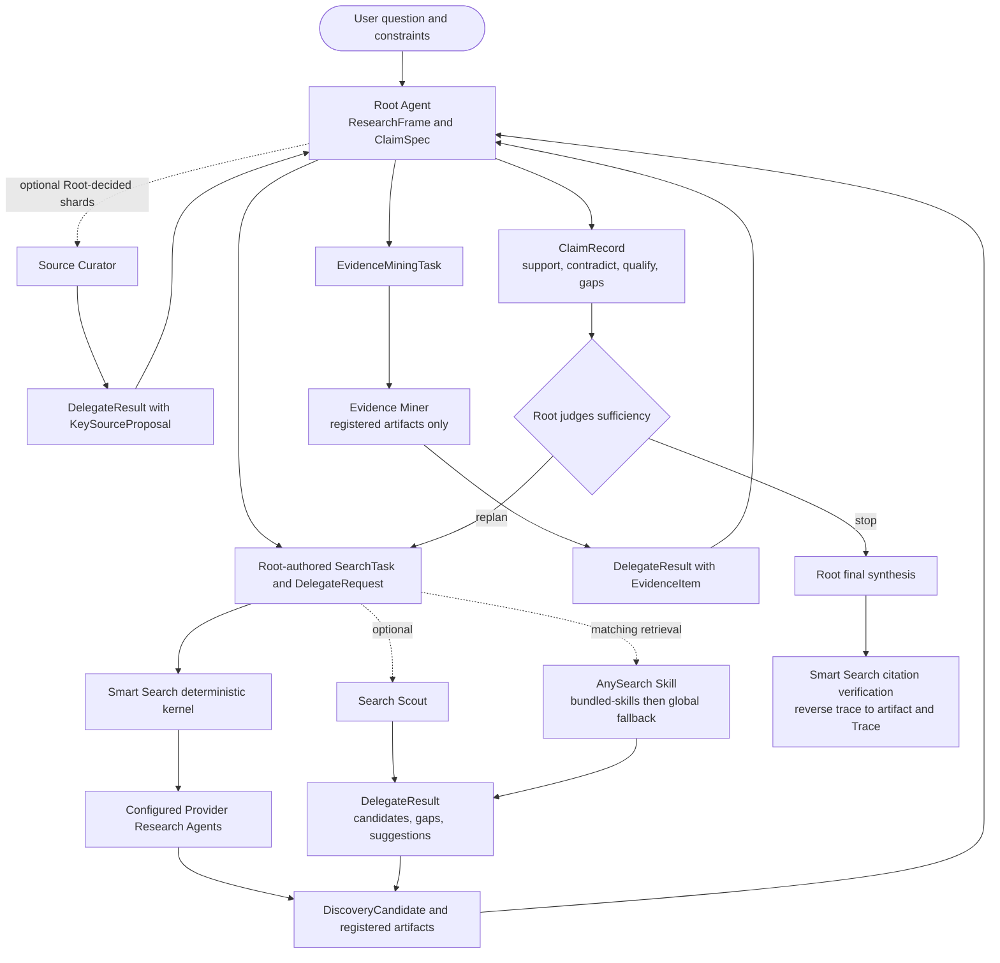

# Smart Search CLI

Use the local `smart-search` command as the default execution layer for web research. This entrypoint keeps only routing, boundaries, and reference selection; load the focused reference file when command details or provider contracts matter.

## What This Skill Is

`smart-search-cli` is an instruction bundle for an AI tool. It explains when to call the local `smart-search` executable, which command fits the user's intent, how to preserve source evidence, and how to interpret provider status and fallback fields.

- The Skill delegates ordinary search and research commands to the configured `smart-search` CLI. It also carries an unchanged AnySearch Skill at `bundled-skills/anysearch`; agents load that bundled Skill from this workflow and invoke its CLI directly. AnySearch is not a Smart Search provider.
- The Skill is not an MCP server, does not store provider API keys, and does not create Trellis, hooks, agents, or commands.
- `smart-search setup --install-skills ...` is the first-install path. After a CLI upgrade, use `skills status` for a read-only check and `skills update` to refresh only the managed Skill files.
- Skill updates do not change provider configuration or API keys. Missing optional keys remain skipped rather than being treated as successful live checks.

## Default Workflow

1. Run `smart-search search "QUERY" --format json` for ordinary web research and wait for the CLI to finish.
2. When setup, configuration, or current provider availability is uncertain, read `references/setup-config.md` and use its diagnostic path. Do not ask users to edit global environment variables by default.
3. After the minimum provider profile is healthy, use only `smart-search` CLI subcommands for web research. Do not call Codex native web search in the same task.
4. Use `smart-search skills status --targets codex --format json` when the installed global skill may be stale; use `smart-search skills update --targets codex --format json` to refresh it without rerunning setup.
5. Use `smart-search smoke --mock --format json` after CLI/provider architecture changes. Use `--live` only when real keys are available and the user expects live checks.
6. Treat `TAVILY_ENABLED=false` as an intentional no-network boundary: do not work around it with direct Tavily or `map` calls. Check diagnostics and live smoke for disabled/skipped Tavily state; Firecrawl remains independently configured.
7. Preserve command lines and source URLs in your answer. Prefer citing fetched pages or `primary_sources`; treat `extra_sources` as follow-up candidates until fetched.
8. In every Smart Search retrieval workflow, read `bundled-skills/anysearch/SKILL.md` relative to this Skill before deciding how AnySearch applies. This is an internal bundled-Skill delegation: do not wait for, emit, or ask the user to invoke `/anysearch` separately.
9. Execute the bundled AnySearch CLI whenever the task needs vertical search, parallel batch search, or known-URL extraction, and use it for general discovery when it materially improves coverage. Follow the bundled Skill's current command contract. For vertical intent, run its `get_sub_domains` operation before searching and include every required parameter it reports.
10. If the bundled Skill is missing or unreadable, fall back to a separately installed global `$anysearch` Skill. If neither is usable, record AnySearch as unavailable and continue with the remaining Smart Search routes.

## Error Handling

When a command returns a provider or recovery failure, read
[`references/error-recovery.md`](references/error-recovery.md) before deciding
whether to retry, replay, fall back, diagnose, or stop. That catalog is the
only instruction source for status-specific and provider-specific handling.
Record future operator guidance there instead of adding error rules to this
entrypoint. Change code and tests only when machine classification, automatic
behavior, or the structured output contract must change.

## Routing

- `search`: first hop for realtime, broad exploration, community signals, multi-source summaries, and routing metadata.
- `route`: explain capability routing without executing providers.
- `research`: live Deep Research executor for end-to-end plan, discovery, fetch/read, gap check, and evidence-only synthesis.
- `deep`: offline Deep Research planner; it does not run providers, fetch pages, or replace default `search`.
- `research-run`: deterministic operations on a caller-held `ResearchRun` dossier. In the agentic architecture, Root uses it to compile and execute Root-authored tasks, import child results, mine registered artifacts, update Claim records, verify stable `[cite:<citation_id>]` markers through the complete evidence chain, render numbered References, and materialize a durable Research Workspace.
- `research-view`: serve a read-only Research Workspace visualizer on `127.0.0.1`. The user starts it in a separate terminal; agents must not start or background the service automatically.
- `research-environment`: install or health-check the isolated Python 3.12 Search Toolkit sidecar used for registered-artifact document mining.
- `zhipu-search`: Chinese-language, domestic China, policy/regulatory, announcements, current news, or China-local source discovery.
- `context7-library` / `context7-docs`: library, SDK, API, framework, or documentation intent. Automatic routes select Context7 only when a query subject overlaps a candidate title/id; otherwise use same-capability Exa fallback. Explicit commands retain the candidate list and supplied library id.
- `exa-search`: official domains, papers, product pages, trusted pages, date/domain-filtered low-noise discovery, and adjacent source discovery through `exa-similar`.
- `fetch`: user-provided URLs or any claim that depends on page content.
- `map`: documentation site or domain structure before fetching many pages from one site.
- Bundled AnySearch: agent-level general or vertical search, parallel batch search, and URL extraction through `bundled-skills/anysearch/SKILL.md`. Load and invoke it from this workflow without requiring a separate slash command; it remains outside the Smart Search CLI provider registry.
- `sciverse-*`: explicit experimental academic search only. Use for catalog/search/semantic/read/relations; do not use Sciverse as `docs_search`, `standard`, or default `search` / `research` fallback.
- `model current`: inspect explicit provider models only. Change models with `smart-search config set XAI_MODEL ...` or `smart-search config set OPENAI_COMPATIBLE_MODEL ...`.

## Key Boundaries

- `smart-search` should resolve from the user's PATH.
- Private API keys should be saved with `smart-search setup` or `smart-search config set`; environment variables remain supported for CI and advanced users.
- In sandboxed runtimes, set `SMART_SEARCH_CONFIG_DIR` to an absolute writable path when the default config directory is unavailable or must be pinned.
- The standard minimum profile requires one configured provider in each of `main_search`, `docs_search`, and fetch capability. Missing required capabilities are hard configuration failures.
- Fallback must remain same-capability only. Do not use Context7 for broad news/web facts or page-extraction providers as documentation search replacements.
- xAI Responses and OpenAI-compatible are peer `main_search` providers. Do not reuse one provider's URL/key to fabricate the other provider as fallback.
- For current-news, policy, finance, health, and other high-risk facts, do not answer from broad `search.content` alone. Fetch key pages and summarize only what fetched text supports.
- Native `web_search` is disabled in this CLI-first workflow unless the user explicitly configures another approved route; do not silently fall back to another web-search route.
- AnySearch failures, missing files, unavailable credentials, quota limits, and provider errors must not abort the whole research task when other Smart Search routes remain usable.

## Multi-Source Research Flow

Root Agent is the sole semantic planner and synthesizer. It dynamically decides task decomposition, replanning, stopping, and how many Search Scouts, Source Curators, or Evidence Miners to launch and how to shard them. Smart Search is the deterministic kernel: it validates contracts, executes configured capabilities, normalizes results, stores append-only artifacts and Trace, and verifies citation links. Children return `DelegateResult` records with gaps and suggestions; only Root can turn suggestions into new tasks.

Use `research-run ... --workspace PATH` to project each returned dossier into a durable Research Workspace, and add one or more `--checkpoint LABEL` options when the caller needs immutable named snapshots. For evidence-backed final delivery, send `research-run verify` a `draft_report` containing stable `[cite:<citation_id>]` markers, the existing `citations` mapping, and `--workspace`; one successful invocation validates the reverse trace and locators, renders first-appearance citation numbers plus one References section, and persists `final_synthesis.md`, authoritative `evidence/citation_verification.json`, and derived `evidence/reference_register.json`. Existing verify callers that omit `draft_report`, including callers that project a raw `final_synthesis`, retain their legacy behavior. Use `research-run materialize` to persist an existing dossier together with optional legacy `final_synthesis` and `citation_verification` fields, or a previously verified additive `reference_register`. The structured Dossier, Trace, Artifact, Evidence, and Claim records remain authoritative; Markdown, the reference register, and the manifest document index are separate projections. `public_trace.jsonl` contains only public trace identity and event metadata. Never save hidden reasoning in the workspace or its visualizer inputs.

The product modes are `quick`, `standard`, and `deep`. Provider Research Agents are Firecrawl Agent, Jina DeepSearch, Exa Agent, and Tavily Research. Their configured/reachable/entitled state controls whether an attempt can run. The default project-agent adapter settings (`gpt-5.6-luna`, reasoning `max`, service tier `priority`) are deployment defaults, not product acceptance conditions.

Before launching a project Agent, read its matching definition in `agents/search_scout.yaml`, `agents/source_curator.yaml`, or `agents/evidence_miner.yaml`. Use a registered project adapter when the Harness provides one; otherwise create a Harness child from that definition. The YAML role contract remains authoritative in either case.

## References

- Current OPPO Linux search flow, Embedding trigger conditions, provider layout, and Mermaid diagram: `references/current-search-flow.md`
- Command examples, evidence files, and guardrails: `references/command-patterns.md`
- Deep Research planner/executor workflow, plan fields, gap check, and smoke matrix: `references/deep-research-mode.md`
- Root-led multi-source architecture, project-agent roles, caller-held dossier operations, Claim lifecycle, document mining, Trace, and reverse citation tracing: `references/agentic-research-architecture.md`
- CLI entrypoints, command signatures, aliases, output fields, exit codes, and tool policy: `references/cli-core.md`
- Setup, config storage, skill installation, provider endpoints, and OpenAI-compatible diagnostics: `references/setup-config.md`
- Intent routing, provider capabilities, source provenance, fallback boundaries, and routing maintenance: `references/provider-routing.md`
- Regression, packaged install checks, release lanes, and release closeout lessons: `references/regression-release.md`
- Compatibility reference map for older instructions that mention the original monolithic file: `references/cli-contract.md`
