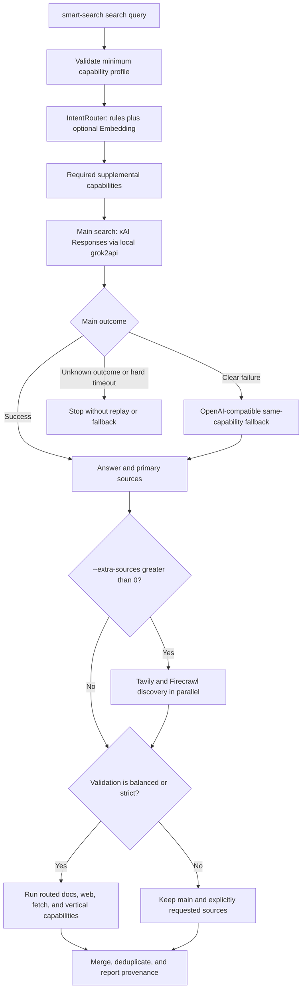
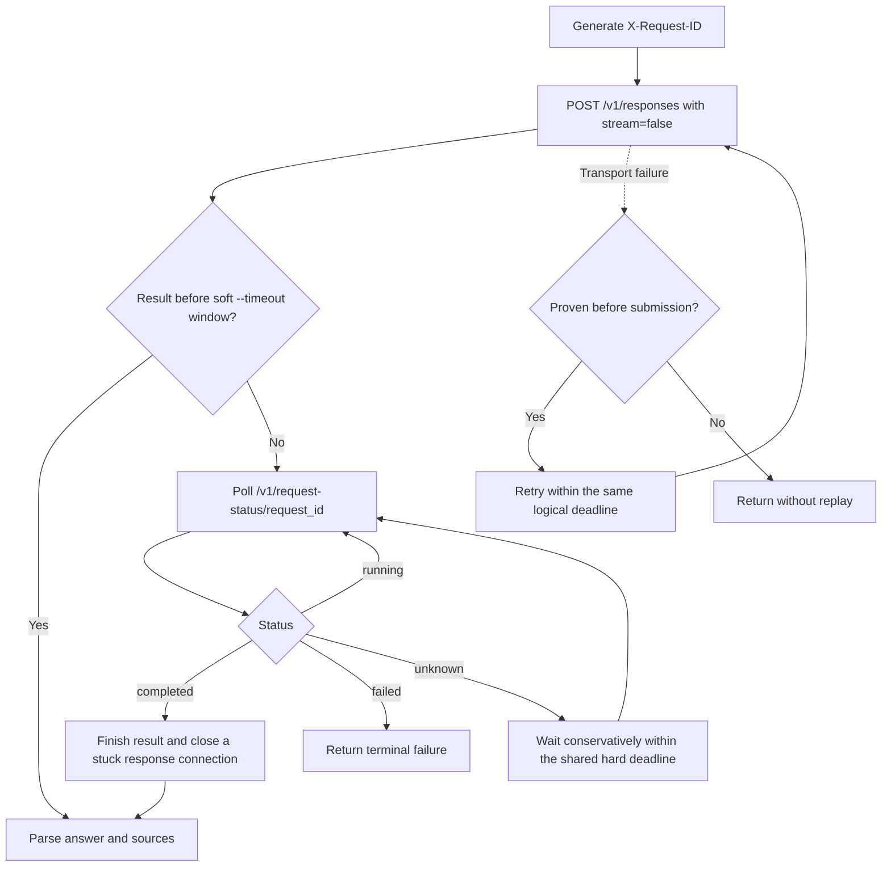

# Current Search Flow (OPPO Linux)

This reference records the active Smart Search workflow on the OPPO Linux Pod. It explains which stage chooses capabilities, which stage generates the main answer, and how long-running xAI requests are tracked. Runtime configuration can change, so refresh the live state before relying on exact models or provider availability:

```bash
smart-search doctor --format json
smart-search model current
smart-search config path --format json
```

The persistent configuration source is:

```text
/home/notebook/code/personal/S9063923/.config/smart-search/config.json
```

## Current Entry Points

| Command | Remote intent routing | Executes search/fetch providers | Purpose |
|---|---:|---:|---|
| `smart-search search` | Yes | Yes | Default search, synthesis, and optional evidence supplementation |
| `smart-search route` | Yes by default | No | Explain routing; use `--router-mode rules` or `off` for a local-only diagnostic |
| `smart-search research` | Yes | Yes | End-to-end research plan, discovery, fetch, gap check, and synthesis |
| `smart-search deep` | No | No | Offline research planner |
| Direct commands such as `fetch`, `map`, `context7-*`, and `exa-*` | No | Yes | Explicit single-capability operation |

## When SiliconFlow Embedding Is Called

The configured semantic router uses SiliconFlow model `Qwen/Qwen3-Embedding-8B`. A request is sent when all of these conditions hold:

1. The command enters `IntentRouter.route()` with remote routing allowed. The public `search`, default `route`, and `research` paths do this.
2. `SMART_SEARCH_INTENT_ROUTER` or `--router-mode` resolves to `hybrid`.
3. `INTENT_EMBEDDING_API_URL`, `INTENT_EMBEDDING_API_KEY`, and `INTENT_EMBEDDING_MODEL` are all configured.

Rules run first. The embedding request compares the query with examples for `docs_search`, `web_search`, `web_fetch`, and `vertical_search`. With the current preset, the leading capability is added only when its cosine score reaches `0.475` and its lead over the second score reaches `0.053`.

Embedding only selects supplemental capabilities. It does not choose the main model, call xAI search tools, or generate the answer. If the embedding endpoint errors or times out, routing degrades to rules and the search continues.

Embedding is skipped for `rules` and `off` modes, the offline `deep` planner, direct provider commands, or an incomplete embedding configuration.

## Active Provider Layout

- Main search: local grok2api through xAI Responses, model `grok-4.20-multi-agent-xhigh`, with `web_search` and `x_search` tools.
- Same-capability main fallback: OpenAI-compatible model `grok-4.3-fast`, used after a clear pre-result xAI failure when fallback is enabled.
- Documentation evidence: `context7`, then `exa` when configured.
- Web discovery implementation order: `zhipu`, `zhipu-mcp`, `tavily`, then `firecrawl`, restricted to configured providers. The operating policy uses Tavily for normal web discovery and avoids direct `zhipu-search`; an internally selected `web_search` supplemental path still follows the configured implementation order.
- Page extraction implementation order: `tavily`, `jina`, `zhipu-mcp-reader`, then `firecrawl`, restricted to configured providers.
- `--extra-sources N`: Tavily and Firecrawl discovery run concurrently after the main answer, with the requested count split approximately 60/40 when both are configured.
- AnySearch: use the separate `$anysearch` Skill. Smart Search vertical routing remains outside the active workflow.

## End-to-End `search` Flow



## xAI Request Lifecycle



## Timeout and Replay Contract

- For xAI Responses, `--timeout` is a soft waiting window. Reaching it triggers request-status checks instead of immediately killing a live search.
- Request status is isolated by client key and polling does not consume inference RPM, concurrency, or billing quota.
- The current polling interval is 15 seconds and the shared hard deadline is 7200 seconds unless `XAI_HARD_TIMEOUT_SECONDS` overrides it.
- Only failures proven to occur before submission are eligible for automatic retry.
- Once submission may have reached grok2api, an unknown outcome or terminal connection anomaly is never replayed. This prevents duplicate searches and duplicate billing.
- OpenAI-compatible keeps its regular hard-timeout behavior; the xAI request-status extension is provider-specific.

## Result Interpretation

- `primary_sources` come from the main synthesis response.
- `extra_sources` contain `--extra-sources` discovery plus routed supplemental evidence.
- `sources` is the merged, deduplicated set.
- `provider_attempts`, `routing_decision`, `fallback_used`, `transport_fallback_used`, and `model_fallback_used` explain the actual path.
- `balanced` and `strict` may run supplemental capabilities selected by the router; `fast` keeps the main search path and skips this automatic supplementation.
- `strict` reports an evidence error when the merged result contains no sources.
